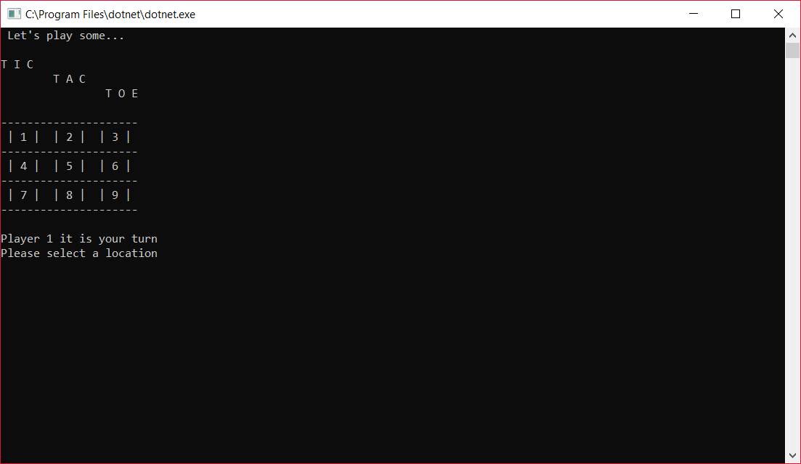
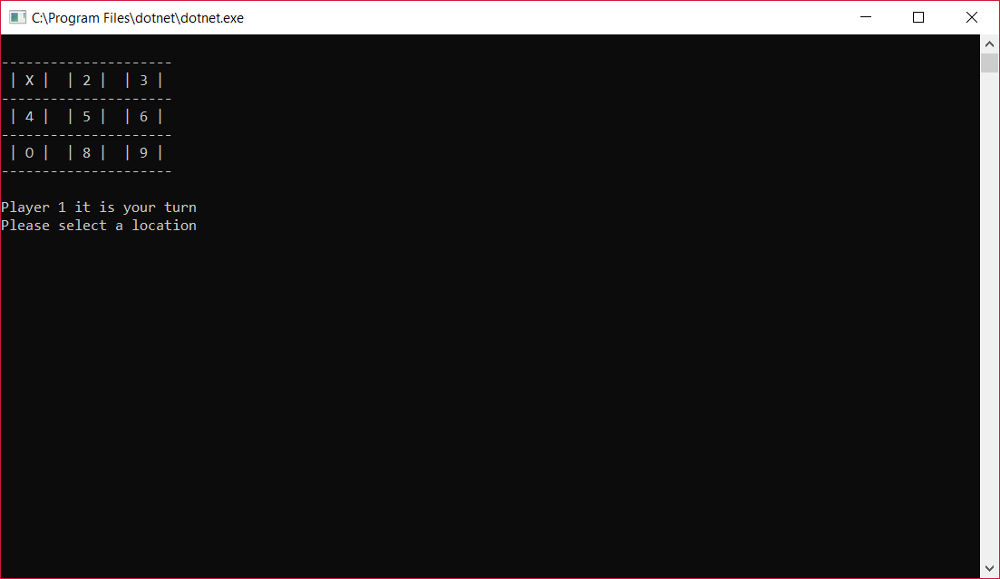
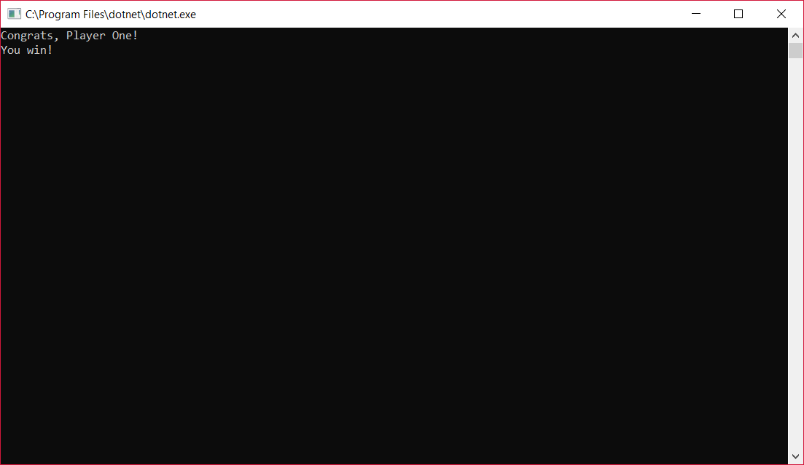
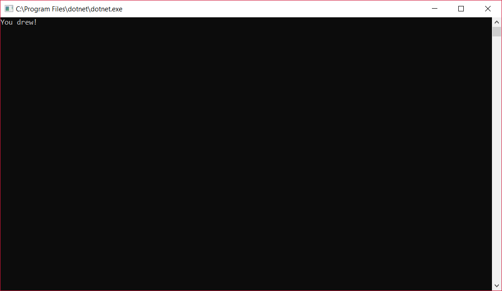

# Lab04-TicTacToe

## Description
Enjoy the classic game Tic Tac Toe from the comfort of your laptop!

## Instructions
- Run program
	- Player 1 will have the X markers
	- Player 2 will have the O markers
- Player 1 is up first. Enter a number between 1 and 9, to place your marker on the corresponding square
- Player 2 is up next
- Keep playing until someone wins or a draw is reached 

## Visual

### Landing Screen

### Sample Game Play

### Winning Screen 

### Draw Screen
